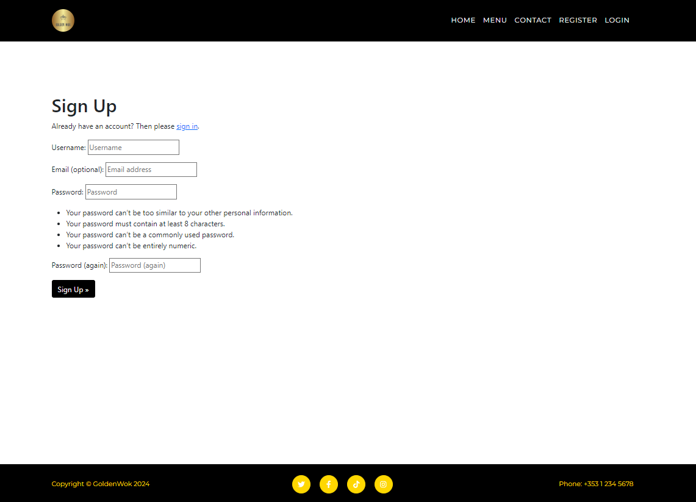

# Golden Wok

Golden Wok is a resturant created for People who are looking for authentic Chinese cuisine. This app allows users to see the menu, leave a review and book a table in advance. This app aims to give users a quick and easy way to understand what the resturant is about and decided whether or not they would like to dine here.

[View live Project Here.](https://ugolden-wok-0812afc9caf2.herokuapp.com/)

## User Stories

1. **Authorization**
    - As a user, I can log in and log out of the site which allows me to make reviews.

2. **See Menu**
    - As a site user I can go to the menu so that I can see what food is being served at the resturant.

3. **Make Reviews**
    - As a site user I can make reviews so that give my opinion on the establishment.

4. **Book A Table**
    - As a site user I can book a table so that I can get a seat at the restaurant.

5. **Read About Resturant**
    - As a Site User I can see the about us section so that read about the resturant.

6. **Opening Hours**
    - As a site user I can see the opening hours so that I can know when to arrive.

## Features

This section goes over the different parts of this project. An explaination will be given of what the features provides the user.

### Exisiting Features

 - **Navigation Bar**

    - This is identical on all pages 

    - This allows user to easily navigate from page to page, section to section across all devices.

    - Depending on the device used, a navbar menu could show or all links will be visible without.

- **MastHead**

    - The Masthead gives the users a nice introduction to the website.

#### Welcome Page

1. **About Us**

    - The about us section provides the user with an insight into who we are, what we do and why we do it.

    - It gives the user extra context about the resturant before they make a booking or read the menu.

    - This section has two buttons that the user can click.

        - One button takes them to the menu page, where they can see which time of day they want to go.

        - The other button takes them to the booking page, if they are interested in coming to the resturant they click this to make a reservation.

2. **Opening Hours**

    - This section gives the user the hours and days the resturant is open.

    - It allows the users to plan ahead to know when they can create time to book.

3. **Reviews**

    - This section is where users can create or read reviews.

    - This allows users to see other peoples opinons and express there own opinons about the resturant.

### Menu Page

1. **Menu**

    - This page shows which dishes are being served at the resturant.

    - The Menu is split up into three sections, Breakfast, Evening and Night Menus.

    - This gives the user the choice on which time they want to book their seats at the resturant.

### Contact Page

1. **Contact**

    - This page allows users to book a table at the resturant.

    - It gives them the ability to give their name, email, number and write a message stating the time, date and numbers of guest attending.

### Register Page

1. **Register**

    - This page allows the user to sign up to the website.

    - Signing up to the website allows the user to leave a review at the bottom of the welcome page.

### Sign In Page

1. **Sign In**

    - If the user ever vists this site and they are signed out, the sign in page allows them to enter their account name and password that they used when they registerd.

### Sign Out Page

1. **Sign Out**

    - If a user has to remove access to their account on a devicem the sign out page allows them to do so.

    - If a user agrees to sign out they must click the login link at the navbar to get back in again.

- **Footer**

    - The footer provides the social links and phone number of the resturant.

    - This allows the users to follow the resturant on other platforms or calll if they have any enquires about the establishment.

## Design 

### Colors

- The colors of the resturant were black and gold. 

- Gold was used because in Chinese culture, gold is associated with power, wealth, longevity, and happiness.

- Black was then used to contrast with the gold

### Wireframes

- **Introduction Page**

- **Opening Hours Section**

- **Review Section**

- **Menu Page**

- **Contact Page**

- **Register Page**

 

- **Sign Out Page**

- **Login Page**

## Technologies Used

This project used a varitey of coding languages, tools, librares and frameworks to build, style and run the app.

### Languages

- HTML
- CSS
- Javascript
- Python

### Libraries & Frameworks

- Bootstrap 5.1.3
- Crispy Bootstrap5 0.7
- Django Allauth 0.57.2
- Django 4.2.13
- Django Summernote 0.8.20.0
- Gunicorn 20.1.0
- Heroku
- PostgresSQL
- Psycopg2 2.9.9
- Sqlparse 0.5.0
- Whitenoise 5.3.0

### Tools
- Github
- Gitpod
- W3C HTML Validator 
- W3C CSS Validator 
- JSHint
- Font Awsome
- Pexel
- Adobe Stock
- Looka

## Testing

### Validator Testing

**HTML**

- No Errors were shown on the following pages:

    - base.html
    - index.html
    - contact.html
    - menu.html
    - login.html
    - logout.html

- The signup page was the only page to recieve error warnings.

- These errors were coming from the django model itself which means there was nothing I could do to fix it.

- These errors did not affect the overall perfomace of the app.

**CSS**

- No Css errors were found 

link can be found [here](http://jigsaw.w3.org/css-validator/validator?lang=en&profile=css3svg&uri=https%3A%2F%2Fugolden-wok-0812afc9caf2.herokuapp.com%2F&usermedium=all&vextwarning=&warning=1).

**Javascript**

- The comments.js was ran through [JSHint.com](https://jshint.com/) and recived:

    - 19 Warnings.
    - 1 undefined variable.

**Python**

- Python code was ran through the [CI Python Linter](https://pep8ci.herokuapp.com/)

    - There were no errors for any of the python code in the menu, contact and about

    - In goldenwok settings.py file there were:

        - 5 Errors

        - 1 Warning

    - I did not change them as these were Django code and I figured it was best not to alter it.

**Accessability**

- I can confirm that the colors and fonts are easy to read and accesible by running it through lighthouse in devtools.

**Compatibility**

- I tested to see if the website would work on Google Chrome, Microsoft Edge and Firefox and an Iphone 8.

### Manual Testing

|What was tested|Result|
|---|---|
|Nav Bar Links work|Pass|
|Nav Bar changes passed on screen width|Pass|
|Each page load correctly|Pass|
|Pages formed correctly deping on device width|Pass|
|Reviews are visible|Pass|
|User can make a account|Pass|
|User can sign out of account|Pass|
|User can make a review|Pass|
|User can edit a review|Pass|
|User can delete a review|Pass|
|User can make a reservation|Pass|
|Footer Links work|Pass|

## Bugs

### Resolved Bugs

- At one point, the review section comment form did not load when the app was ran.

- This was because it was created using Django crispy forms and the form was unable to read the post and review functions in about/view.py.

- To fix this I first had to merge the two functions into one.

- I then went into the admin controls and created 3 post titles for my breakfast, evening and night menus.

## Deployment

- This site was deployed on the Heroku app. The steps to deploy are as follows:

  1. Create an account on [Heroku](https://dashboard.heroku.com/apps).

  2. In the Heroku Dashboard click create a new app.

  3. Type in the app name (ugolden-wok) and select region (Europe)

  4. Once done go to settings and click reveal config vars.

  5. inside config vars add the word "SECRET_KEY" to key with a value of the secret key you name.

  7. Another value is added, this one being the word "DATABASE_URL" to the key with a value of your postgress URL.

  7. Then go to deploy and click on the Github deploy method.

  8. Then connect you app to your repository.

  9. Finally click on the deploy branch on the manual deploy section at the bottom of the page.

[View live project here](https://ugolden-wok-0812afc9caf2.herokuapp.com/).

## Credits

### Layout

- The layout of the project was inspired by the agency theme obtained by [Start Bootsrap](https://startbootstrap.com/previews/agency).

### Logo

- The logo was created using [Looka](https://looka.com/logo-maker/?gad_source=1&gclid=CjwKCAjwko21BhAPEiwAwfaQCBaSXuNOSQH7pCUHNiMb9HN7ELRIqC5eUdh3_e5hNUJSRkRM4QMiYhoC4acQAvD_BwE).

### Buttons

- The button images were gotten from [fontawesome.com](https://fontawesome.com/).

### Reviews Form

- The Review section layout was taken from the code institute [i think therefore i blog](https://learn.codeinstitute.net/ci_program/diplomainfullstacksoftwarecommoncurriculum).

### Contact Form

- The Contact section layout was also taken from the code institute [i think therefore i blog](https://learn.codeinstitute.net/ci_program/diplomainfullstacksoftwarecommoncurriculum).

### Media

- The background image in the masthead was found on [Pexels.com](https://www.pexels.com/photo/photo-of-cafe-interior-1307698/).

- The background image in the contact section was found on [Wallpaperflare.com](https://www.wallpaperflare.com/close-up-photo-of-formal-table-setting-blur-cutlery-dining-wallpaper-uiojm).