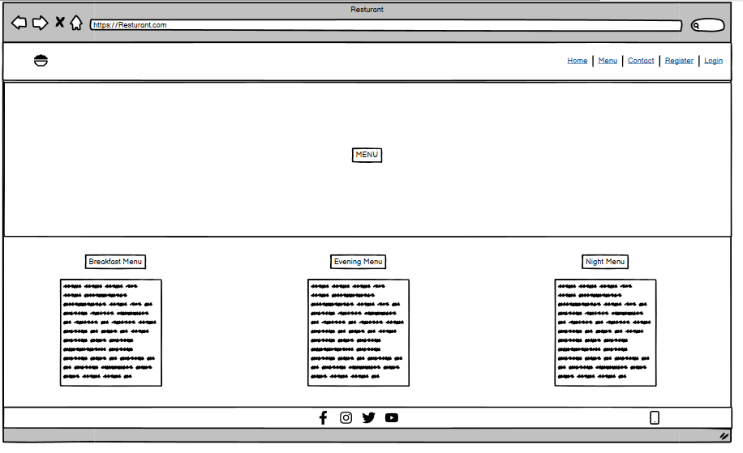

# Golden Wok

Golden Wok is a resturant created for People who are looking for authentic Chinese cuisine. This app allows users to see the menu, leave a review and book a table in advance. This app aims to give users a quick and easy way to understand what the resturant is about and decided whether or not they would like to dine here.

[View live Project Here](https://ugolden-wok-0812afc9caf2.herokuapp.com/)

## User Stories

1. **Authorization**
    - As a user, I can log in and log out of the site which allows me to make reviews.

2. **See Menu**
    - As a site user I can go to the menu so that I can see what food is being served at the resturant.

3. **Make Reviews**
    - As a site user I can make reviews so that give my opinion on the establishment.

4. **Book A Table**
    - As a site user I can book a table so that I can get a seat at the restaurant.

5. **Read About Resturant**
    - As a Site User I can see the about us section so that read about the resturant.

6. **Opening Hours**
    - As a site user I can see the opening hours so that I can know when to arrive.

## Features

This section goes over the different parts of this project. An explaination will be given of what the features provides the user.

### Exisiting Features

 - **Navigation Bar**

    - This is identical on all pages 

    - This allows user to easily navigate from page to page, section to section across all devices.

    - Depending on the device used, a navbar menu could show or all links will be visible without.

- **MastHead**

    - The Masthead gives the users a nice introduction to the website.

#### Welcome Page

1. **About Us**

    - The about us section provides the user with an insight into who we are, what we do and why we do it.

    - It gives the user extra context about the resturant before they make a booking or read the menu.

    - This section has two buttons that the user can click.

        - One button takes them to the menu page, where they can see which time of day they want to go.

        - The other button takes them to the booking page, if they are interested in coming to the resturant they click this to make a reservation.

2. **Opening Hours**

    - This section gives the user the hours and days the resturant is open.

    - It allows the users to plan ahead to know when they can create time to book.

3. **Reviews**

    - This section is where users can create or read reviews.

    - This allows users to see other peoples opinons and express there own opinons about the resturant.

### Menu Page

1. **Menu**

    - This page shows which dishes are being served at the resturant.

    - The Menu is split up into three sections, Breakfast, Evening and Night Menus.

    - This gives the user the choice on which time they want to book their seats at the resturant.

### Contact Page

1. **Contact**

    - This page allows users to book a table at the resturant.

    - It gives them the ability to give their name, email, number and write a message stating the time, date and numbers of guest attending.

### Register Page

1. **Register**

    - This page allows the user to sign up to the website.

    - Signing up to the website allows the user to leave a review at the bottom of the welcome page.

### Sign In Page

1. **Sign In**

    - If the user ever vists this site and they are signed out, the sign in page allows them to enter their account name and password that they used when they registerd.

### Sign Out Page

1. **Sign Out**

    - If a user has to remove access to their account on a devicem the sign out page allows them to do so.

    - If a user agrees to sign out they must click the login link at the navbar to get back in again.

- **Footer**

    - The footer provides the social links and phone number of the resturant.

    - This allows the users to follow the resturant on other platforms or calll if they have any enquires about the establishment.

## Design 

### Colors

- The colors of the resturant were black and gold. 

- Gold was used because in Chinese culture, gold is associated with power, wealth, longevity, and happiness.

- Black was then used to contrast with the gold

### Wireframes

- **Introduction Page**

- **Opening Hours Section**

- **Menu Page**

- **Contact Page**

- **Register Page**

- **Sign Out Page**

- **Login Page**

